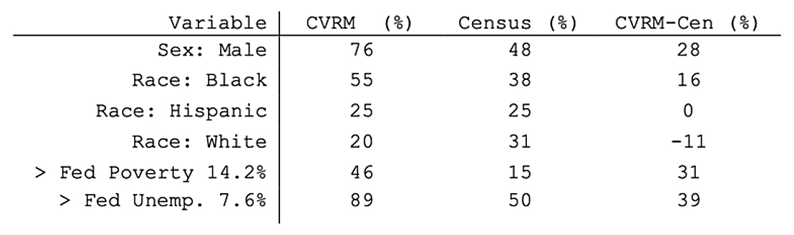

---
output:
  html_document: default
---
### Implications  
</br>

##### **Machine Learning and Crime Risk Management**  
##### Context for Predictive Policing in Chicago, IL 
In late 2016/early 2017, with a grant from the US Department of Justice and in collaboration with a team of researchers at the Illinois Institute of Technology, the **Chicago Police Department** (CPD) began using a **proprietary predictive policing algorithm**. These and similar technologies are increasingly common in police departments across the US and are used—at least in part—to combat **resource constraints** in various geographic areas. When the Chicago Police Department (CPD) initially rolled out their project now known as the _**Violence Reduction Strategy**_, it was referred to as the _**Strategic Subjects Algorithm**_.  

_Note: We refer to that same predictive policing algorithm by another formal name, the **Crime and Victim Risk Mitigation model**._  

In order to develop the algorithm, a database of **prior arrest records data spanning 2006-2016** was used as the training dataset. Based on **6 variables in the arrest records data**, the algorithm—still in use today despite creative re-branding—generated a **risk score** designed to identify individuals who posed a **high risk of committing a violent crime** (e.g., homicide, assault/battery) in the next 18-months. Risk scores ranged from 100-500, where **100 = very low** and **500 = Very High**.  
</br>

#### **Given patterns of `racial profiling`, `racialized violence`, and `police brutality` in police departments across the US, a model that provides future-facing information based on backwards-facing `data steeped in a racist `history` must be interrogated.**  
</br>

##### **Racial Bias in Predictive Policing**  
##### Reproducing Bias via Black-Box Technologies 
While the goal of predicting risk in order to mitigate it is ostensibly neutral, the training dataset used to develop the _**Crime and Victim Risk Mitigation model**_ contained historical records of police arrests over a 10-year time period.  
</br>
The table below shows a comparison of demographic information from the **CVRM dataset** compared with the same demographic data for the city of Chicago taken from the **2010 US Census**.   
</br>
```{r pressure, echo=FALSE, fig.cap="source: Census.gov", out.width = '60%'}

```

Data used to train the CVRM are decidedly different from broader Chicago city data. Individuals assigned a risk score by the model are **more likely to be male and Black, less likely to be white, and more likely to live in districts of high poverty and unemployment** relative to the population of Chicago.  


</br>
